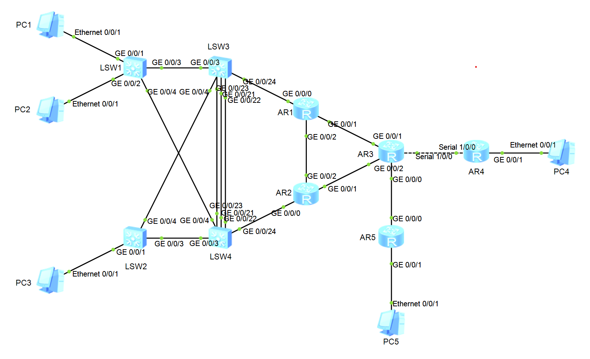

# 1+X考试模拟题

### Vlan规划

| 设备 | 端口号 | TYPE VID or AllowPassVid |
| :--: | :--: | :--: |
| LSW1 | GE 0/0/1 | access 10 |
|  | GE 0/0/2 | access 10 |
|  | GE 0/0/3 | trunk 10 20 |
|  | GE 0/0/4 | trunk 10 20 |
| LSW2 | GE 0/0/1 | hybrid 20 untaged 20 |
|  | GE 0/0/3 | trunk 10 20 |
|  | GE 0/0/4 | trunk 10 20 |
| LSW3 | GE 0/0/3 | trunk 10 20 |
|  | GE 0/0/4 | trunk 10 20 |
|  | GE 0/0/24 | access 100 |
|  | Eth-Trunk1 | trunk 10 20 |
| LSW4 | GE 0/0/3 | trunk 10 20 |
|  | GE 0/0/4 | trunk 10 20 |
|  | GE 0/0/24 | access 101 |
|  | Eth-Trunk1 | trunk 10 20 |

### IP地址规划

| 设备 | 端口号 | IPaddress  |
| :--: | :--: | :--: |
| AR1 | GE 0/0/0 | 10.1.1.2/24 |
|  | GE 0/0/1 | 10.2.2.1/24 |
|  | GE 0/0/2 | 12.1.1.1/24 |
|  | LoopBack0 | 1.1.1.1/32 |
| AR2 | GE 0/0/0 | 11.1.1.2/24 |
|  | GE 0/0/1 | 11.2.2.1/24 |
|  | GE 0/0/2 | 12.1.1.2/24 |
|  | LoopBack0 | 2.2.2.2/32 |
| AR3 | GE 0/0/0 | 14.1.1.1/24 |
|  | GE 0/0/1 | 10.2.2.2/24 |
|  | GE 0/0/2 | 11.2.2.2/24 |
|  | Serial 1/0/0 | 13.1.1.1/24 |
|  | LoopBack0 | 3.3.3.3/32 |
| AR4 | GE 0/0/1 | 192.168.4.254/24 |
|  | Serial 1/0/0 | 13.1.1.2/24 |
|  | LoopBack0 | 4.4.4.4/32 |
| AR5 | GE 0/0/0 | 14.1.1.2/24 |
|  | GE 0/0/1 | 192.168.5.254/24 |
|  | LoopBack0 | 5.5.5.5/32 |
| LSW3 | VlanIF 10 | 192.168.10.100/24 |
|  | VlanIF 20 | 192.168.20.101/24 |
|  | VlanIF 100 | 10.1.1.1/24 |
|  | LoopBack0 | 6.6.6.6/32 |
| LSW4 | VlanIF 10 | 192.168.10.101/24 |
|  | VlanIF 20 | 192.168.20.100/24 |
|  | VlanIF 101 | 11.1.1.1/24 |
|  | LoopBack0 | 7.7.7.7/32 |

## 任务1: 设备命名
- 根据拓扑图片进行搭建网络并进行设备命名

## 任务2: Vlan与IP地址规划
- 按照Vlan与IP编址表格进行配置

## 任务3: 链路聚合
- 为保证链路稳定性, 需进行手动(Lacp模式)链路聚合
- 链路聚合ID为1, 成员接口为GE0/0/21, GE0/0/22, GE0/0/23

## 任务4: RSTP
- 为防止环路破坏网络可靠性, 在LSW1, LSW2, LSW3, LSW4之间配置STP协议
- STP模式为RSTP, LSW3为主根桥, LSW4为备份根桥
	- 设置根桥需使用`stp root primary/secondary`
- 为最大限度保证网络稳定性, 避免主机频繁重启导致网络波动, 要求所有与PC机相连端口进行端口隔离, 不参加STP计算, 直接进入转发状态

## 任务5: VRRP
- 为增加网关可靠性, 在LSW3, LSW4设置虚拟网关
	- Vlan10设置在备份组1中, 将LSW3设置为主网关, 优先级设置为120
	- Vlan20设置在备份组2中, 将LSW4设置为主网关, 优先级设置为120
- 还需设置故障检测, 若发现上行端口出现故障, 需要将优先级降低30

## 任务6: 出口设计
- 在AR4, AR5上设置缺省路由, 下一跳为AR3
- 在AR3上设置静态路由, 目的网段分别指向192.168.4.0, 192.168.5.0
- 在Serial接口上设置PPP协议, 并将认证模式设置为CHAP
	- AR4为主动认证方, 用户名为huawei, 密码为Huawei123

## 任务7: OSPF协议
- 为保证网络维护难度降低, 需配置OSPF动态路由协议
- 在LSW3, LSW4, AR1, AR2, AR3, AR5上配置OSPF
	- AR3的Serial接口无需宣告, 其他皆采用32位精确宣告
	- AR3的GE0/0/0, 与AR5的全部接口宣告在Area1, 其余全部宣告在骨干区域内
- 为保证网络安全需要在AR1, AR2, AR3的全部相连接口配置接口认证
	- 算法采用md5, keyID 1, 密钥类型为Cipher, 密码为Huawei123

## 任务8: 路由引入
- 为了使网络互通, 需将静态路由引入OSPF中, 引入类型为1
	- `import-route <protocol> type <1/2>

